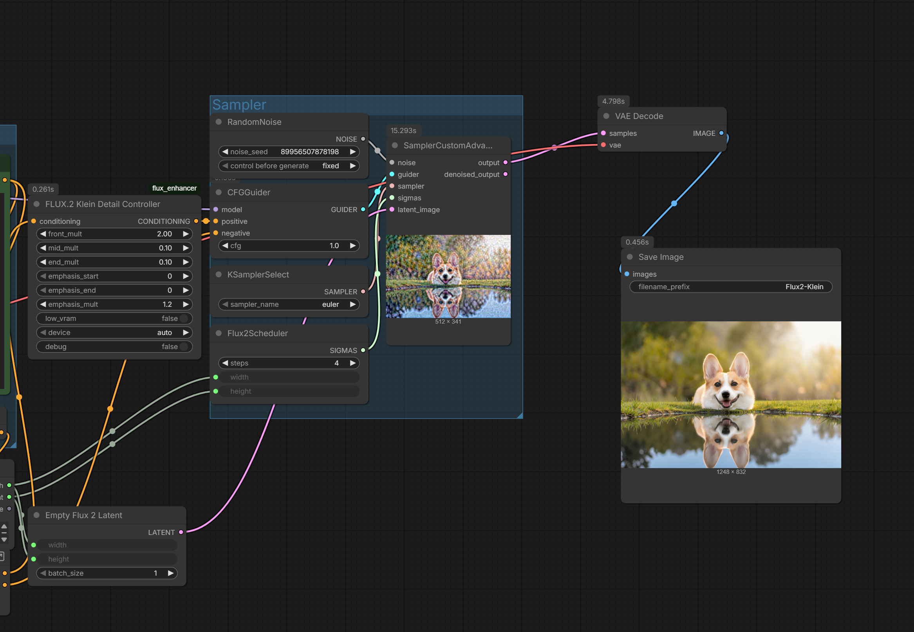
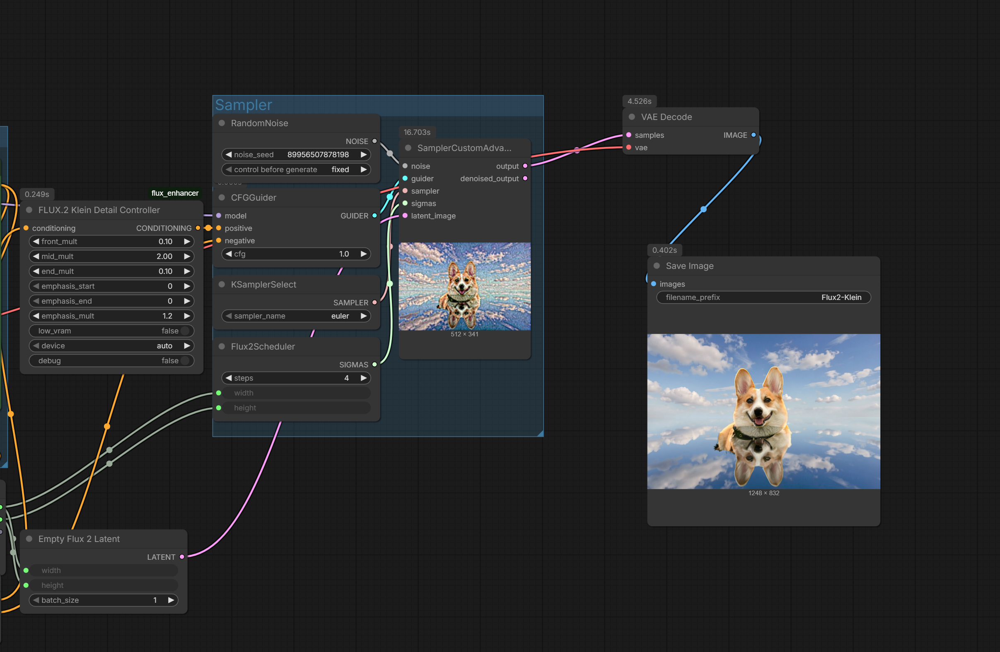
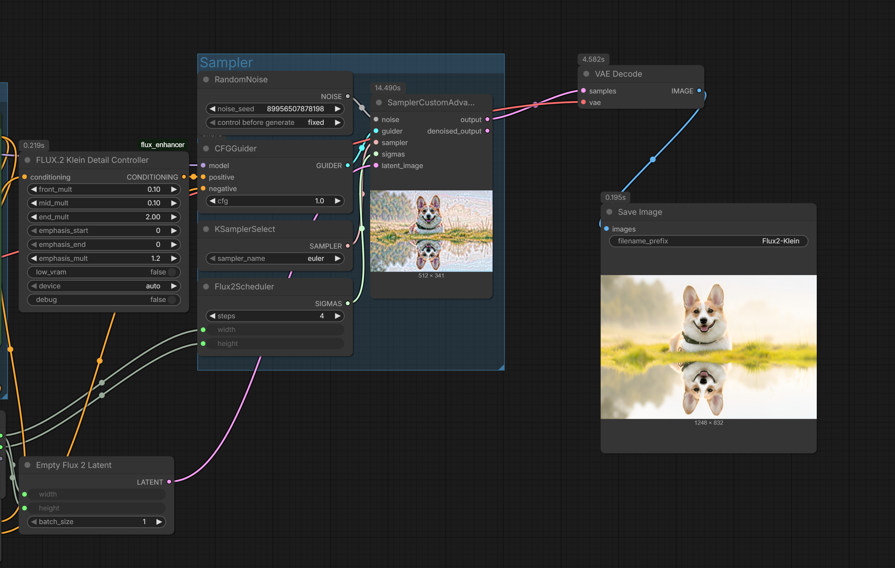
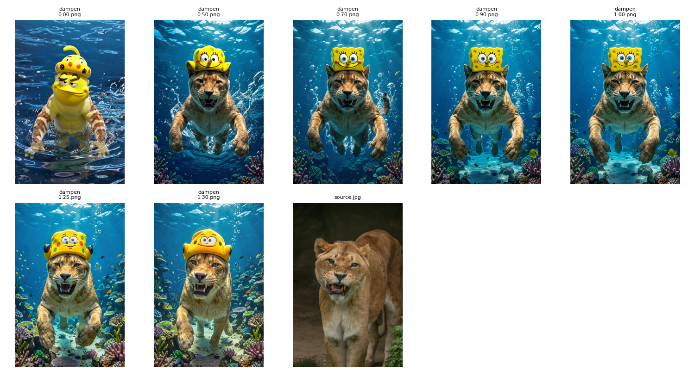

# ComfyUI-Flux2Klein-Enhancer

Conditioning enhancement and reference latent control for FLUX.2 Klein 9B in ComfyUI. Built from empirical analysis and forward-pass tracing of the model's dual-stream architecture.

## What This Does (( NEW DISCOVERY!! ))

FLUX.2 Klein uses a Qwen3 8B text encoder that outputs conditioning tensors of shape `[batch, 512, 12288]`. Through diagnostic analysis and model hook tracing, I verified:

- **Text Conditioning**: `[1, 512, 12288]` tensor with ~67 active tokens (auto-detected from attention mask)
- **Reference Latent**: Stored separately in metadata as `[1, 128, H, W]` - NOT merged into text conditioning
- **Dual-Stream Architecture**: Text and image streams are processed separately through double_blocks, then concatenated for single_blocks

### Verified Architecture (from forward-pass hooks)

```
┌─────────────────────────────────────────────────────────────────┐
│                    FLUX.2 Klein Forward Pass                    │
├─────────────────────────────────────────────────────────────────┤
│                                                                 │
│  Reference Latent [1,128,55,74]  →  patchify  →  [1, 4070, 128] │
│  Noisy Latent [1,128,55,74]      →  patchify  →  [1, 4070, 128] │
│                                         │                       │
│                                    CONCATENATE                  │
│                                         ↓                       │
│                                  [1, 8140, 128]                 │
│                                         │                       │
│                                      img_in                     │
│                                         ↓                       │
│                                  [1, 8140, 4096]                │
│                                                                 │
│  Text Conditioning [1,512,12288] → txt_in → [1, 512, 4096]      │
│                                                                 │
├─────────────────────────────────────────────────────────────────┤
│  DOUBLE BLOCKS (×8): Separate streams                           │
│    img_stream: [1, 8140, 4096]                                  │
│    txt_stream: [1, 512, 4096]                                   │
├─────────────────────────────────────────────────────────────────┤
│  SINGLE BLOCKS (×24): Concatenated                              │
│    combined: [1, 8652, 4096]  (8140 + 512)                      │
└─────────────────────────────────────────────────────────────────┘
```

**Without reference latent**: img_in receives `[1, 4070, 128]`, single_blocks process `[1, 4582, 4096]`

This means:
- **Text enhancement** modifies the txt_stream input
- **Reference control** modifies half of the img_stream input (the reference portion)
- These are **independent controls** that can be combined

## Installation

1. Navigate to your ComfyUI custom nodes folder:
   ```
   cd ComfyUI/custom_nodes/
   ```

2. Clone this repository:
   ```
   git clone https://github.com/capitan01R/ComfyUI-Flux2Klein-Enhancer.git
   ```

3. Restart ComfyUI

## Nodes

### Core Enhancement Nodes

<a href="examples/node_fixed.png">
  
</a>

<a href="examples/updated_sample.png">
  
</a>

### FLUX.2 Klein Enhancer

General-purpose text conditioning enhancement for both text-to-image and image editing workflows.

#### Parameters

| Parameter | Default | Range | Description |
|-----------|---------|-------|-------------|
| `magnitude` | 1.0 | 0.0 to 3.0 | Direct scaling of active region embeddings. Values above 1.0 increase prompt influence, below 1.0 decrease it. |
| `contrast` | 0.0 | -1.0 to 2.0 | Amplifies differences between tokens. Positive values sharpen concept separation, negative values blend them. |
| `normalize_strength` | 0.0 | 0.0 to 1.0 | Equalizes token magnitudes. Higher values balance emphasis across all tokens in the prompt. |
| `edit_text_weight` | 1.0 | 0.0 to 3.0 | Image edit mode only. Values below 1.0 preserve more of the original image, above 1.0 follows the prompt more strongly. |
| `active_end_override` | 0 | 0 to 512 | Manual override for active region end. 0 = auto-detect from attention mask. |
| `low_vram` | False | True/False | Use float16 computation on CUDA devices. |
| `device` | auto | auto/cpu/cuda:N | Compute device selection. |
| `debug` | False | True/False | Prints tensor statistics and modification details to console. |

### FLUX.2 Klein Detail Controller

Regional control over prompt conditioning. Divides active tokens into front/mid/end sections.

#### Parameters

| Parameter | Default | Range | Description |
|-----------|---------|-------|-------------|
| `front_mult` | 1.0 | 0.0 to 3.0 | Multiplier for first 25% of active tokens (typically subject/main concept). |
| `mid_mult` | 1.0 | 0.0 to 3.0 | Multiplier for middle 50% of active tokens (typically details/modifiers). |
| `end_mult` | 1.0 | 0.0 to 3.0 | Multiplier for last 25% of active tokens (typically style/quality terms). |
| `emphasis_start` | 0 | 0 to 200 | Start position of custom emphasis region. |
| `emphasis_end` | 0 | 0 to 200 | End position of custom emphasis region. 0 = disabled. |
| `emphasis_mult` | 1.0 | 0.0 to 3.0 | Multiplier for the custom emphasis region. |
| `low_vram` | False | True/False | Use float16 computation on CUDA devices. |
| `device` | auto | auto/cpu/cuda:N | Compute device selection. |
| `debug` | False | True/False | Prints debug information to console. |

---

## NEW: Reference Latent Control

<a href="examples/new_wf.png">
  
</a>

<a href="examples/new_nodes.png">
  
</a>


### The Discovery

Through forward-pass hook tracing, I discovered that **reference latents are completely separate from text conditioning**. The reference latent `[1, 128, H, W]` is:

1. Stored in `conditioning[0][1]['reference_latents']` metadata
2. Patchified into `[1, num_patches, 128]` 
3. Concatenated with the noisy latent before `img_in` projection
4. Processed through the image stream independently of text

This means we can control reference influence directly without touching text conditioning.

### FLUX.2 Klein Ref Latent Controller

Direct manipulation of the reference latent tensor before it enters the model.

#### Parameters

| Parameter | Default | Range | Description |
|-----------|---------|-------|-------------|
| `strength` | 1.0 | 0.0 to 5.0 | Scale reference latent. **0 = ignore reference (like txt2img), 1 = normal, >1 = stronger structure lock** |
| `blend_with_noise` | 0.0 | 0.0 to 1.0 | Blend reference with noise. 0 = pure reference, 1 = pure noise |
| `channel_mask_start` | 0 | 0 to 127 | Start channel for selective modification |
| `channel_mask_end` | 128 | 1 to 128 | End channel for selective modification |
| `spatial_fade` | none | none/center_out/edges_out/top_down/left_right | Apply spatial gradient to reference strength |
| `spatial_fade_strength` | 0.5 | 0.0 to 1.0 | Intensity of spatial fade |
| `debug` | False | True/False | Print modification stats |

#### Quick Test Settings

| Test | strength | Expected Result |
|------|----------|-----------------|
| Baseline | 1.0 | Normal behavior |
| Kill reference | 0.0 | Should look like txt2img |
| Boost reference | 2.0 | Stronger structure preservation |

### FLUX.2 Klein Text/Ref Balance

Simple single-slider control for balancing text prompt vs reference structure.

#### Parameters

| Parameter | Default | Range | Description |
|-----------|---------|-------|-------------|
| `balance` | 0.5 | 0.0 to 1.0 | **0 = reference only (ignore prompt), 0.5 = balanced, 1 = text only (ignore reference)** |
| `debug` | False | True/False | Print scaling factors |

<a href="examples/Figure_003.png">
  
</a>

---

## Front/Mid/End Separation Examples

<a href="examples/front.png">
  
</a>
<a href="examples/mid.png">
  
</a>
<a href="examples/end.png">
  
</a>

**Prompt:** turn only the ground into a mirror surface reflecting the sky, keep the full dog and its body unchanged and add the dog's reflection below

---

## Sectioned Encoder Node

<a href="examples/new_node.png">
  
</a>
<a href="examples/eg1.png">
  
</a>
<a href="examples/eg2.png">
  
</a>
<a href="examples/eg3.png">
  
</a>

---

## Preserve Original - Solving FLUX Klein's Preservation Problem

FLUX Klein has a consistency problem. Sometimes it nails the preservation of subjects and objects. Sometimes it completely ignores what you're trying to keep and generates something else entirely. There was no native way to control this.

This node exposes preservation control that FLUX Klein doesn't provide. You can now control exactly how much original structure is maintained versus how much the prompt can modify the generation.

### The Modes

#### dampen (Recommended)
Reduces modification strength before applying changes. This is the most reliable mode for precise preservation.

**For consistent identity/object preservation: 1.20 to 1.30**

#### linear
Applies full modifications, then blends the result back with the original.

#### hybrid
Dampens parameters first, then blends the result.

#### blend_after
Same as linear, just a different name.

### Usage

- **1.20-1.30 (dampen)**: Recommended starting point for solid preservation
- **1.40-1.50**: Tighter control when needed, very prompt-dependent
- **0.0-1.0**: Standard range from full enhancement to balanced preservation

<a href="examples/updated_01_26.png">
  
</a>
<a href="examples/added_preservation.png">
  
</a>
<a href="examples/Figure_01.png">
  
</a>

---

## How It Works

### Text Conditioning Enhancement

#### Magnitude
Direct scaling of all embedding vectors in the active region:
```python
active = active * magnitude
```

#### Contrast (Safe Implementation)
Computes the mean embedding across the sequence, then amplifies deviations:
```python
seq_mean = active.mean(dim=1, keepdim=True)
deviation = active - seq_mean
if contrast >= 0:
    scale = 1.0 + contrast
else:
    scale = math.exp(contrast)  # Never inverts, asymptotes to 0
active = seq_mean + deviation * scale
```

Note: Negative contrast uses exponential scaling to prevent semantic inversion that occurs with linear scaling below -1.

#### Normalize Strength
Equalizes token magnitudes toward a uniform value:
```python
token_norms = active.norm(dim=-1, keepdim=True)
mean_norm = token_norms.mean()
normalized = active / token_norms * mean_norm
active = active * (1.0 - normalize_strength) + normalized * normalize_strength
```

### Reference Latent Control

The reference latent is stored in metadata and processed separately from text:
```python
ref_latents = meta.get("reference_latents", None)  # [1, 128, H, W]
ref_latents[0] = ref_latents[0] * strength  # Direct scaling
```

This modified tensor is then patchified and concatenated with the noisy latent, entering the img_stream with adjusted magnitude.

### Active Region Detection
Auto-detected from attention mask:
```python
attn_mask = meta.get("attention_mask", None)
nonzero = attn_mask[0].nonzero()
active_end = int(nonzero[-1].item()) + 1
```

---

## Presets

### Text-to-Image

```
              BASE   GENTLE   MOD   STRONG   AGG     MAX    CRAZY
              ----    ----    ----    ----    ----    ----    ----
magnitude:    1.20    1.15    1.25    1.35    1.50    1.75    2.50
contrast:     0.00    0.10    0.20    0.30    0.40    0.60    1.20
normalize:    0.00    0.00    0.00    0.15    0.25    0.35    0.60
edit_weight:  1.00    1.00    1.00    1.00    1.00    1.00    1.00
```

### Image Edit

```
              PRESERVE   SUBTLE   BALANCED   FOLLOW   FORCE
              --------   ------   --------   ------   -----
magnitude:       0.85     1.00       1.10     1.20    1.35
contrast:        0.00     0.05       0.10     0.15    0.25
normalize:       0.00     0.00       0.10     0.10    0.15
edit_weight:     0.70     0.85       1.00     1.25    1.50
ref_strength:    1.50     1.20       1.00     0.70    0.30
```

### Reference Latent Control (NEW)

```
              LOCK     STRONG    NORMAL    LOOSE    IGNORE
              ----     ------    ------    -----    ------
ref_strength: 3.00      2.00      1.00     0.50      0.00
```

---

## Visual Results: Vanilla vs. With Flux2Klein-Enhancer

Exact same workflow, seed and prompt - only difference is using the node or not.

### Source Photo
[](examples/source_02.jpg)

### Comparison 1
**Prompt:** turn only the ground into a mirror surface reflecting the sky, keep the full dog and its body unchanged and add the dog's reflection below

Vanilla Flux.2 Klein          |  With Enhancer Node
:-----------------------------:|:-----------------------------:
[](examples/vanilla_01.png) | [](examples/with_node_01.png)

### Comparison 2
**Prompt:** replace the grass with shallow ocean water and add realistic water reflections of the dog, keep the sunny lighting

Vanilla                       |  With Enhancer Node
:-----------------------------:|:-----------------------------:
[](examples/vanilla_02.png) | [](examples/with_node_02.png)

---

## Technical Details

- **Model**: FLUX.2 Klein 9B
- **Text Encoder**: Qwen3 8B (4096 hidden dim, 36 layers)
- **Conditioning Shape**: [batch, 512, 12288]
- **Reference Latent Shape**: [batch, 128, H, W] (stored in metadata)
- **Joint Attention Dim**: 12288
- **Architecture**: 8 double_blocks (separate streams) + 24 single_blocks (concatenated)
- **img_in projection**: [128] → [4096]
- **txt_in projection**: [12288] → [4096]
- **Guidance Embeds**: False (step-distilled model, no CFG)

## Methodology

All findings were verified through:
1. **Conditioning Diagnostic**: Tensor structure analysis
2. **Forward Hook Tracing**: Attached hooks to img_in, txt_in, double_blocks, single_blocks
3. **Comparative Analysis**: With vs without reference latent runs
4. **Model Introspection**: forward() signature analysis

The reference latent concatenation was confirmed by observing:
- With reference: `img_in` receives `[1, 8140, 128]` (4070 × 2 patches)
- Without reference: `img_in` receives `[1, 4070, 128]`

## Acknowledgments

Built through empirical analysis and forward-pass hook tracing of FLUX.2 Klein's conditioning structure and dual-stream architecture.
